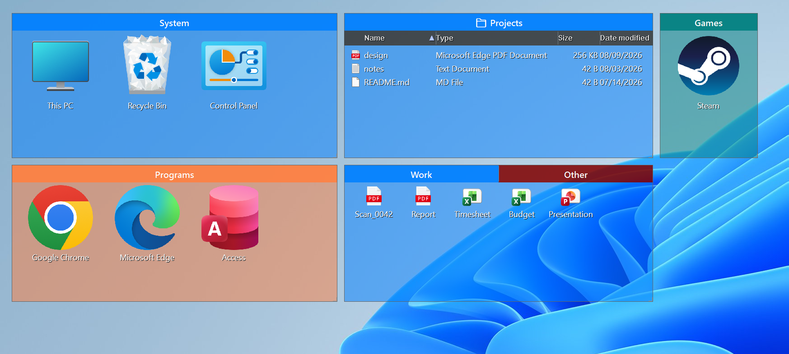
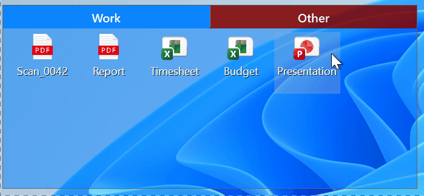
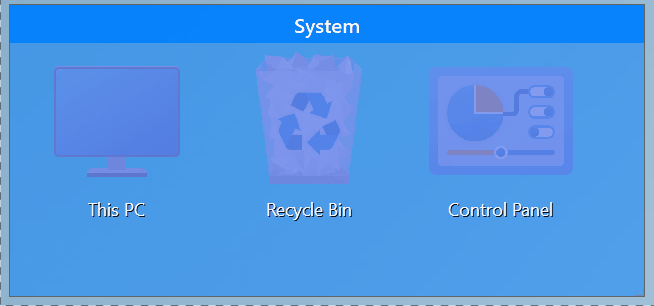
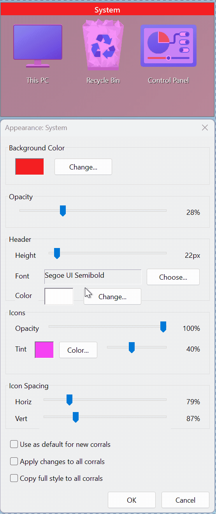

[](https://github.com/guHe330/DexCorral/actions/workflows/build-release.yml)
[](LICENSE)
[](https://github.com/guHe330/DexCorral/releases)
[](#requirements)

# DexCorral

DexCorral is a lightweight native Windows desktop organizer. It groups desktop icons into
customizable areas called Corrals, with support for tabs, transparency, virtual folders, and
multiple monitors.



> **Alpha software.** DexCorral is a personal project developed around my own workflow. Expect bugs
> and occasional breaking changes.

> **Private by design.** No ads, telemetry, or user tracking. Network access is limited to an
> optional update check, disabled by default.

## Features

*   Organize desktop icons into movable, resizable Corrals
*   Multiple tabs per Corral
*   Virtual folders backed by real directories
*   Adjustable background, header, border, and icon opacity
*   Hover reveal and roll-up
*   Small, medium, large, and details views
*   Catch-all Corral for new desktop items
*   Multi-monitor and resolution-aware layouts
*   Native C++ / Win32, ~1 MB executable + DLL, no runtime dependencies

## Screenshots

### Tabs



### Opacity on hover



### Live appearance preview



## Requirements

*   Windows 11 (build 22000 or newer)
*   Windows 10 is unsupported

## Installation

Download the latest version from [Releases](https://github.com/guHe330/DexCorral/releases).

### Installer

The installer registers the Explorer shell extension, configures startup, and launches DexCorral
without requiring an Explorer restart.

The binaries are currently unsigned, so Windows SmartScreen may display a warning.

### Portable / Manual

Place `DexCorral.exe` and `DexCorralHook.dll` in the same directory, then run as Administrator:

```powershell
DexCorral.exe --register
DexCorral.exe --startup
```

Full installation and uninstall instructions are in the [User Manual](docs/USER_MANUAL.md#installation).

## Documentation

*   [User Manual](docs/USER_MANUAL.md)
*   [Changelog](docs/CHANGELOG.md)
*   [Build Guide](docs/BUILD_GUIDE.md)
*   [Contributing](docs/CONTRIBUTING.md)

## Issues

Bug reports are appreciated.

*   [Open bugs](https://github.com/guHe330/DexCorral/issues?q=is%3Aissue+label%3Abug)
*   [Feature requests](https://github.com/guHe330/DexCorral/issues?q=is%3Aissue+label%3Aenhancement)

## Project Scope

DexCorral is built primarily for my own desktop and workflow. Feature requests and pull requests are
welcome, but changes that do not fit that direction may be declined.

Please open an issue before implementing larger changes.

Forks are welcome — that's what the GPL is for.

## Third-Party Libraries

*   [nlohmann/json](https://github.com/nlohmann/json) 3.11.3 — [MIT](https://github.com/nlohmann/json/blob/develop/LICENSE.MIT)

## License

DexCorral is licensed under the [GPLv3](LICENSE).
