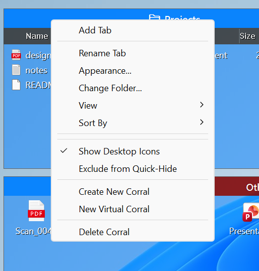
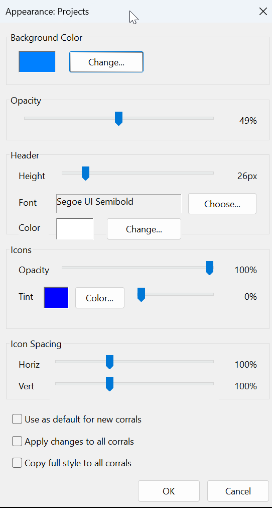

# DexCorral User Manual

DexCorral organizes your Windows desktop icons into shaded, customizable areas called **Corrals**. Icons stay real desktop icons — DexCorral integrates with Explorer through a shell extension, so drag-and-drop, context menus, and file operations keep working exactly as they always have.

## Installation

DexCorral requires **Windows 11** (build 22000 or newer). Windows 10 is end of life and is neither tested nor supported; both the installer and `DexCorral.exe --register` refuse to run on it.

### Installer (recommended)

1. Download `DexCorral_<version>_Setup.exe` from the [Releases](https://github.com/guHe330/DexCorral/releases) page.
2. Run it — Administrator rights are required to register the shell extension. (SmartScreen may warn; see [Troubleshooting](#troubleshooting).)
3. The installer registers the shell extension and starts DexCorral inside the running Explorer — no Explorer restart and no logout needed. A default Corral appears on your desktop immediately.

DexCorral loads automatically at every login — its shell extension is loaded by Explorer on startup, so there is nothing to configure.

### Portable package

1. Download `Portable_DexCorral_<version>.zip` and extract it to any folder.
2. Open a command prompt **as Administrator** in that folder and run `DexCorral.exe --register` (one-time setup). On an unsupported Windows version this stops with a message instead of registering — adding `--force` (`DexCorral.exe --register --force`) registers anyway, unsupported and untested.
3. Run `DexCorral.exe --startup` to start DexCorral in the current session, or restart Explorer / log out and back in.

### Uninstalling

Uninstall from **Settings > Apps > Installed apps**, or via the Start Menu group's **Uninstall DexCorral** entry. The uninstaller asks whether to **keep your configuration** (corral layouts and appearance settings) — choose *Yes* if you plan to reinstall later. It then unregisters the shell extension and restarts Explorer to fully unload.

After uninstalling, icons that were inside Corrals reappear as normal desktop icons; you may want to rearrange them (right-click desktop > **Sort by > Name**).

## Core Concepts

### Corrals
A Corral is a shaded, semi-transparent window holding a group of icons. Icons assigned to it are hidden from the regular desktop and drawn inside the Corral instead.

### Tabs
Each Corral can hold multiple **tabs**, each with its own title, icon list, background color, view mode, and header font — several groups (e.g. "Work", "Games", "Downloads") in one place on the desktop.

**Reordering tabs:** hover a tab to reveal a grip handle ("⠿") on its left edge, then drag it left or right.

### Catch-All
One tab can be the **Catch-All**: new files and shortcuts landing on the desktop are captured into it automatically.

### Virtual Corrals
A virtual tab mirrors any folder on your PC — point it at `Downloads` or a project directory and its files appear inside the Corral, kept in sync as the folder changes. It is a live view: manage the files in the folder itself (drops onto a virtual tab are not accepted).

## Managing Corrals

### Creating
* Right-click the DexCorral **tray icon** (or the background of any Corral) and choose **Create New Corral**.
* Choose **New Virtual Corral** instead to pick a folder and create a Corral mirroring it.

### Moving and Resizing
* Drag the **title bar** to move a Corral.
* Drag any **edge or corner** to resize. While moving or resizing, Corrals snap to screen edges and align to other Corrals on the same monitor.
* Corrals are immune to **Win+D / Show Desktop** — they stay visible with your desktop.

### Roll-Up
Double-click the title bar to **roll up** a Corral so only the title bar remains visible. Double-click again to expand it.

### Multi-Monitor
Corral positions are remembered **per monitor and per resolution**. Moving a Corral to another monitor or changing display resolution restores the layout you used there last.

### Customizing
Right-click a Corral's title bar or background:



* **Add Tab** — add a new tab to this Corral.
* **Detach Tab** — move the current tab out into its own Corral window (shown when the Corral has more than one tab).
* **Rename Tab** — change the current tab's title.
* **Appearance...** — open the appearance dialog (see below).
* **Change Folder...** — for virtual tabs, point the tab at a different folder.
* **View** — switch between **Small / Medium / Large Icons** and **Details** (a list with name, type, size, modified date, and cloud sync status for OneDrive files).
* **Catch-All (receives new files)** — make this tab the catch-all for new desktop items.
* **Add Special Icon** — add special shell items such as the Recycle Bin to the Corral.
* **Show Desktop Icons** — toggle visibility of all native desktop icons.
* **Create New Corral / New Virtual Corral** — same as the tray menu.
* **Close Tab / Delete Corral** — remove the current tab, or the whole Corral if it's the last tab. Contained icons return to the desktop.

### Appearance Dialog
**Appearance...** gives live-preview control over:



* **Background color** and **opacity** — fully opaque down to fully transparent.
* **Border opacity** — solid frame down to none. The bottom-right resize grip stays visible either way.
* **Header** — title bar height, opacity, font face/size, font color, and text opacity (font settings are per tab).
* **Labels** — opacity of the icon captions, independent of the icons themselves.
* **Icons** — opacity, tint color, and tint strength.
* **Icon spacing** — horizontal and vertical spacing (50–200%).

Checkboxes at the bottom let you save the current style as the **default for new corrals**, **apply the changes** you just made to all corrals, or **copy the full style** to all corrals.

#### Header opacity and tabs
Header opacity fades the title bar and tab strip independently of the Corral fill.

* Inactive tabs are derived from the header opacity automatically — always dimmer than the active tab, no second slider to keep in sync.
* The slider stops short of fully transparent, because the header is the Corral's grab handle. Rolled-up Corrals are kept a little more visible than the setting; unrolling restores it exactly.
* Hovering a Corral fades its header, border, icons and text up to full strength, and back when you leave.

#### Text opacity
The tab title and the icon labels fade on their own sliders, so text can be dialled back
without touching what is behind it — or turned off entirely for a Corral that is just icons.

* **Header → Text** fades the active tab's title. It is a per-tab setting, like the font face and color.
* **Opacity → Labels** fades every icon caption in the Corral.
* Both go all the way to invisible. Nothing is lost: the header still drags, rolls up and
  right-clicks with no title on it, and icons stay visible and clickable with no captions.
* Both fade in on hover along with the icons, border and header, on the same timing. Text set
  to 0% is therefore not gone — it appears when you move the mouse over the Corral and fades
  back out when you leave.

## Working with Icons

### Adding
* Drag any icon from the desktop (or files from an Explorer window) and drop it onto a Corral.
* New desktop items land automatically in the Catch-All tab, if one is set.

### Using
* **Double-click** an icon to open it.
* **Drop a file onto an icon** inside a Corral to invoke its target — e.g. drop a document onto an application's icon to open it with that app.
* **Double-click an icon's label** to rename it in place.
* **Scroll** with the mouse wheel or trackpad when a tab holds more icons than fit; a slim scrollbar appears on hover.

### Right-Click Menu
Right-clicking an icon shows the standard Windows context menu (Open, Cut, Copy, Delete, Properties, ...) plus **Remove from Corral**, which returns the icon to the regular desktop without deleting anything.

## Quick-Hide

Double-click an empty spot on the desktop to hide everything at once: all native desktop icons and all corrals (they fade out). Double-click the desktop again to bring everything back exactly as it was.

* Corrals can opt out: right-click a corral and check **Exclude from Quick-Hide** to keep it visible while everything else hides.
* The tray menu's **Quick-Hide Everything** entry toggles the same state.
* Quick-hide is temporary — restarting DexCorral always restores your normal desktop.

## Tray Icon

The DexCorral tray icon's right-click menu offers:

* **About** — version and license information.
* **Create New Corral** / **New Virtual Corral**.
* **Show Desktop Icons** — toggle all native desktop icons.
* **Quick-Hide Everything** — hide/show icons and corrals at once (same as double-clicking the desktop).

## Desktop Integration

Because DexCorral hooks Explorer's desktop directly:

* Icons inside Corrals are invisible to desktop hit-testing, rubber-band selection, and keyboard navigation — you can't accidentally select or disturb them.
* Desktop **Sort by** and auto-arrange never move Corral-owned icons, and visible icons are compacted so sorting leaves no gaps where hidden icons used to be.
* Corral-owned icons are immune to repositioning by Explorer or third-party tools — only DexCorral moves them.

## Configuration

All settings (corral layouts, tabs, colors, fonts, assigned files) are stored in a single JSON file:

```
%APPDATA%\DexCorral\config.json
```

The format is forward- and backward-compatible: fields missing from an older config simply get default values. The file is written automatically; if you edit it by hand, do so while DexCorral is not running.

## Known Limitations

* **Identical filenames on the user and Public desktop** — corral membership is stored as a bare filename, so DexCorral assumes the one on the user desktop. The same *display* name with different filenames (a folder `test` next to `test.txt`) is handled correctly.

## Troubleshooting

* **SmartScreen / antivirus warnings** — the binaries are currently unsigned; this is expected for software from a small developer. Code signing is planned.
* **Corrals don't appear after install** — right-click the desktop once to wake the shell, or log out and back in (the Start-with-Windows entry re-injects DexCorral at login).
* **Desktop icons misbehave** — restarting Explorer resets the hook: `Stop-Process -Name explorer -Force; Start-Process explorer.exe` in PowerShell, or via Task Manager.
* **Bug reports** — please file issues at the [GitHub issue tracker](https://github.com/guHe330/DexCorral/issues).
